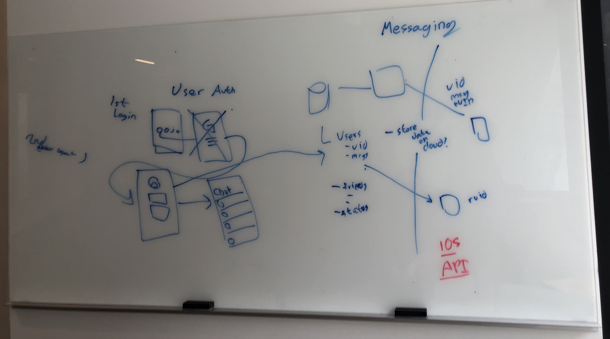

# Meeting Notes for 4/14/22

## Backend Infrastructure for Sending/Recieving Messages
We discussed a potential infrastructure for sending and receiving messages. Suppose we have two clients. The first client will send a message to the second client. To do this, the first client makes an API call to the Messages API, sending the message, it s user id, and the user id of the recipient.

The API will populate the `messages` attribute in the recipient user's document in the `users` collection. The recipient client, in the meantime, checks the recipient user's document every T seconds. When new messages are read, the recipient client stores the messages locally and deletes the messages from the document [1]. 

## User Authentication
We discussed several possibilities for user authentication, including phone numbers, email/gmail, etc. We decided to keep things simple for now; upon opening the app for the first time, a user will be prompted to enter their username, and any information we want to collect from them (such as first, last name and date of birth).

## Goals for this week
We plan to start working on a proof-of-concept where a message can be sent from one device to another. This will require setting up the backend infrastructure described above. Additionally, the frontend would need to start developing on Xcode to have a way to send messages. This could be a simple text box and a send button for sending, with populating text bubbles for receiving. The frontend would also need to call the Messages API and keep checking the database for updates. For testing, dummy calls can be used to simulate text conversation. We will work on drafting screens such as the signup/login flow and the examples provided in [report 1](https://github.com/DavidSRoy/sociable/blob/master/reports/report1.md).

## Footnotes
[1] We also discussed an alternative where the messages are not deleted from the database. This could potentially result in the free quota to be reached much faster. However, it would be a plus point if we wanted a user's data to persist on the cloud. We talked about how Whatsapp does not store messages on the cloud and follows a similar model to what we have described. [More info here](https://www.google.com/search?q=does+whatsapp+store+messages+on+server&client=safari&rls=en&sxsrf=APq-WBsUmxPnNcA3ib18LmCq5UIkS1EvSA%3A1649973572687&ei=RJlYYufRKdr59APinJbYBQ&oq=does+whats&gs_lcp=Cgdnd3Mtd2l6EAMYADIFCAAQkQIyBQgAEJECMgoIABCABBCHAhAUMgUIABCABDIFCAAQgAQyBQgAEIAEMgUIABCABDIFCAAQgAQyBQgAEIAEMgUIABCABDoECCMQJzoOCC4QgAQQsQMQxwEQ0QM6DgguEIAEELEDEMcBEKMCOggIABCABBCxAzoLCAAQgAQQsQMQgwE6BAgAEEM6BQgAELEDOgsILhCABBDHARCvAToFCC4QgARKBAhBGABKBAhGGABQAFjwB2COEGgAcAF4AIAB2gGIAfAHkgEFNy4xLjKYAQCgAQHAAQE&sclient=gws-wiz).
